# Condominios Venezuela - SGC (Sistema de Gestión Condominial)

> [!IMPORTANT]
> Note: This project is currently under development. All the relevant details will be updated as the project progresses.

## 🚀 Project Overview
The CondoVe is a robust, full-stack web application designed to streamline and optimize employee management processes. 
Built on the MERN stack (MongoDB, Express.js, React.js, Node.js), the SGC provides a seamless, user-friendly experience for employees and HR professionals alike.

## Early Screenshots

### CondoVE Entry Page : 

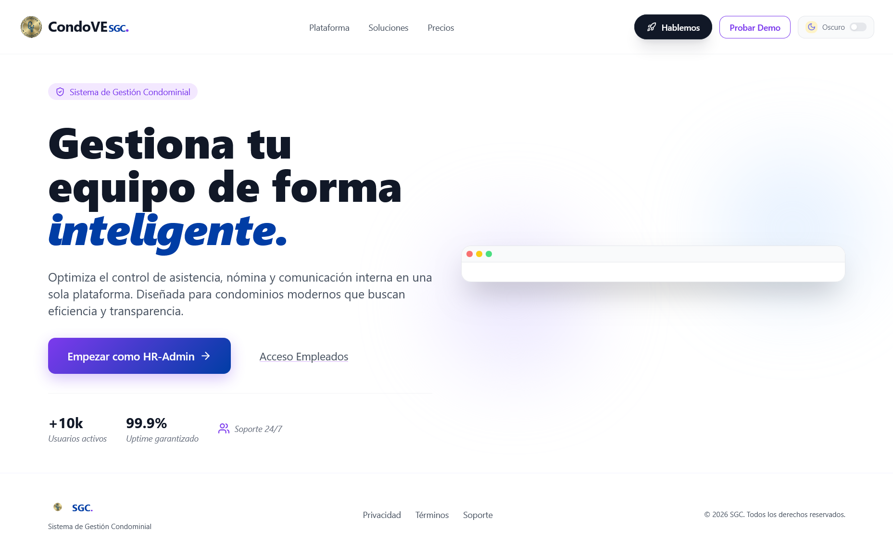
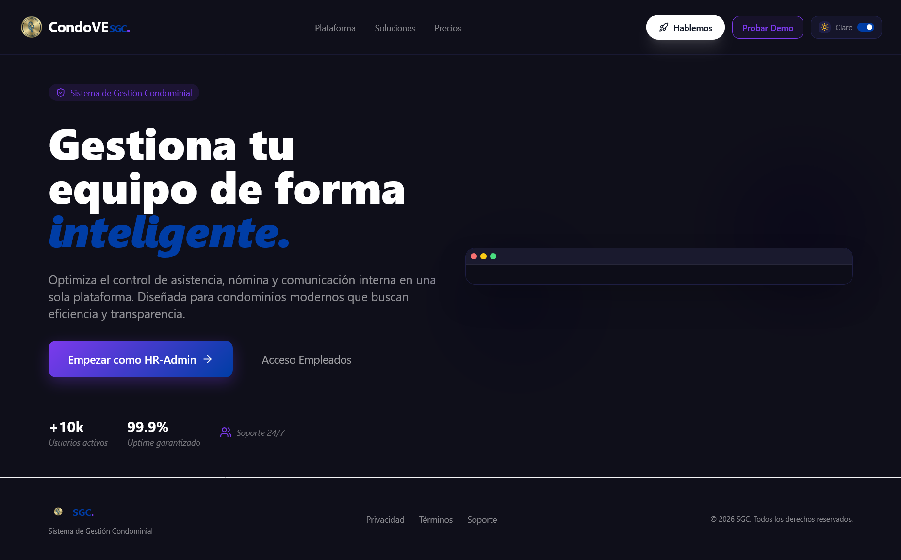

### CondoVE Coordinación/Junta Sign Up : 

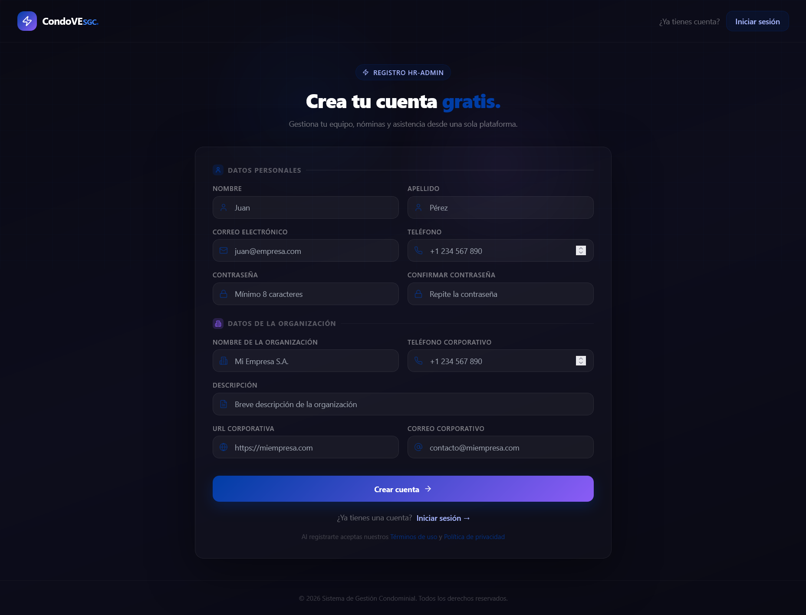

### CondoVE Login : 

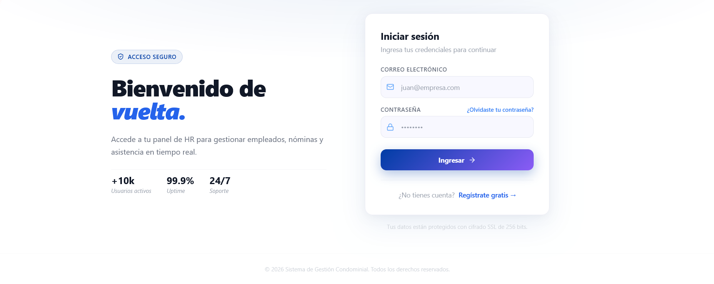

### CondoVE Coordinación/Junta Dashboard : 

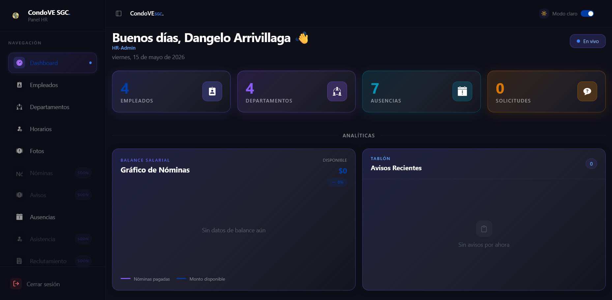


### CondoVE Coordinación/Junta Photos Page : 

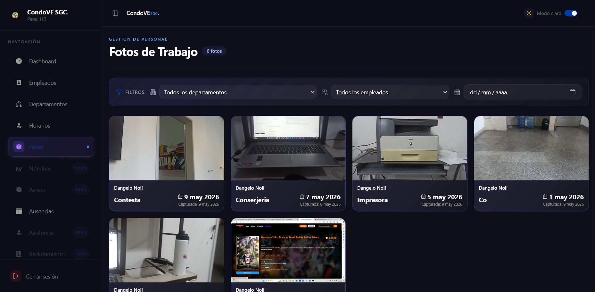

### CondoVE Coordinación/Junta Schedule Page : 

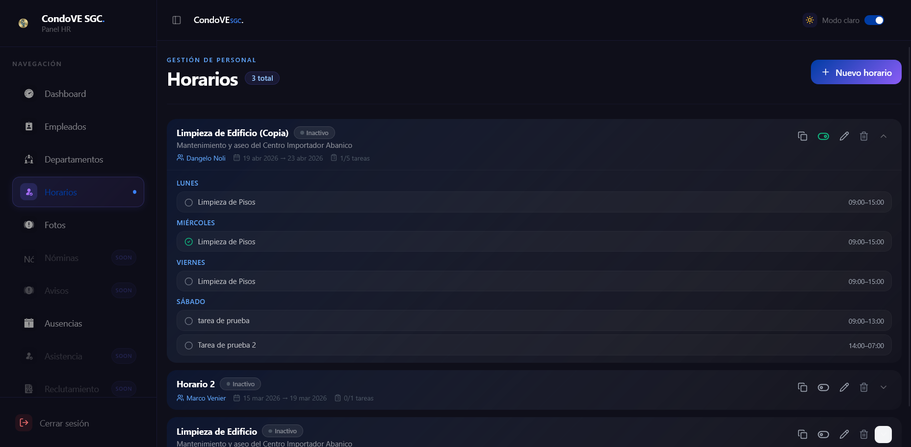

### CondoVE Empleados My Schedule Page : 

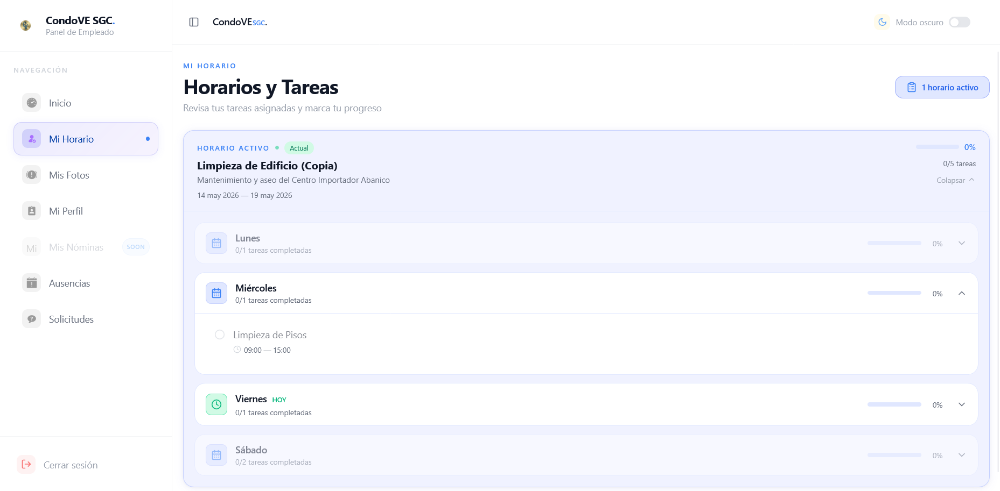

### CondoVE Empleados My Profile Page : 

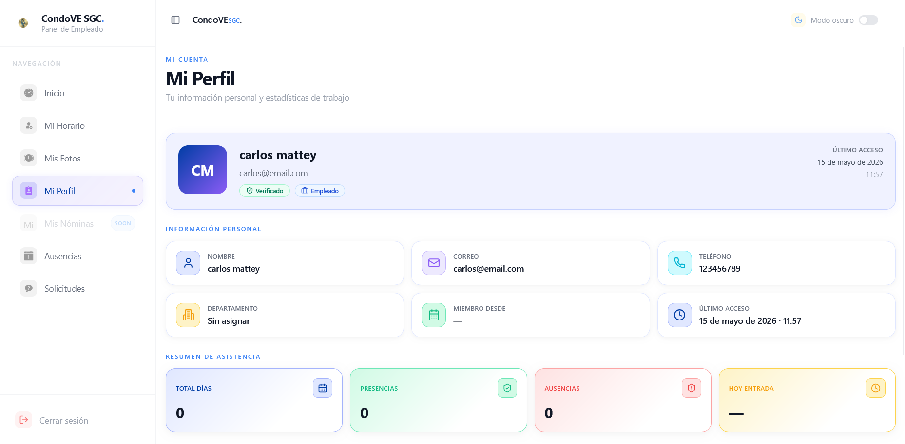

### CondoVe Mobile Light Mode : 
<p align="center">
  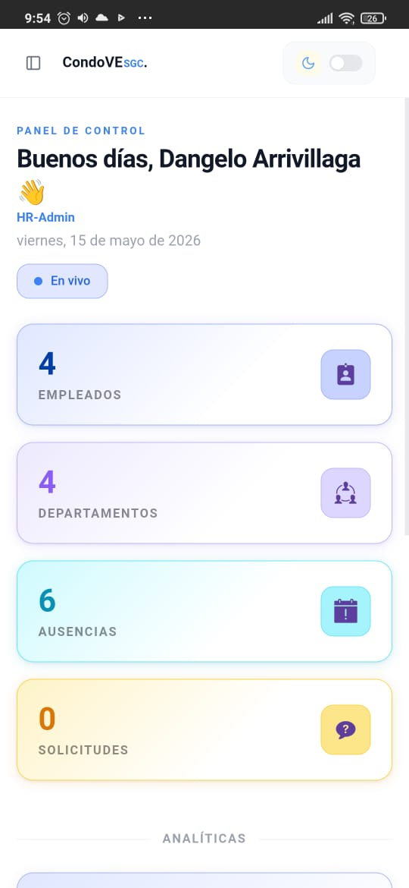
  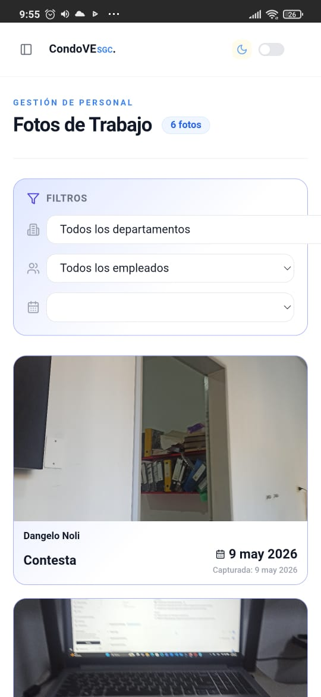
  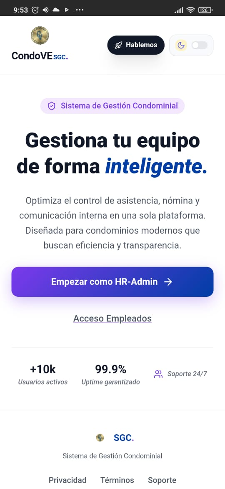
  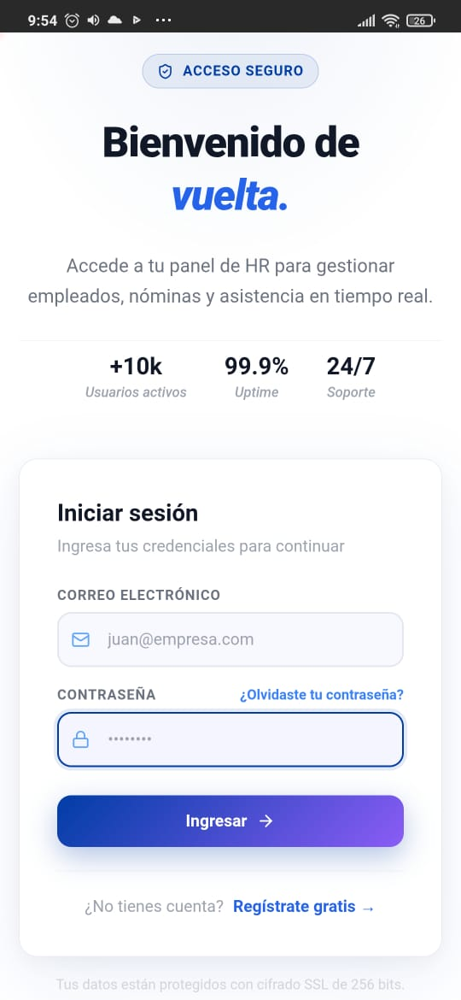
  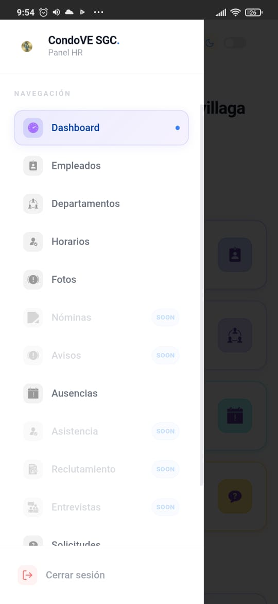
</p>

### CondoVe Mobile Dark Mode : 
<p align="center">
  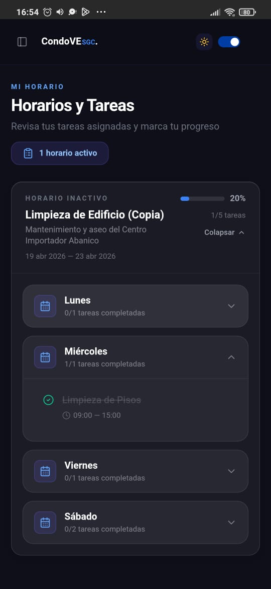
  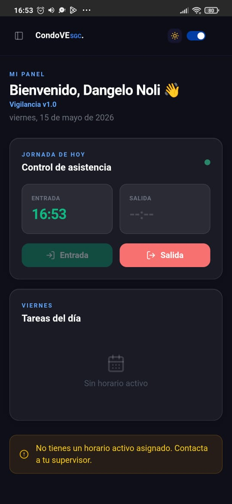
  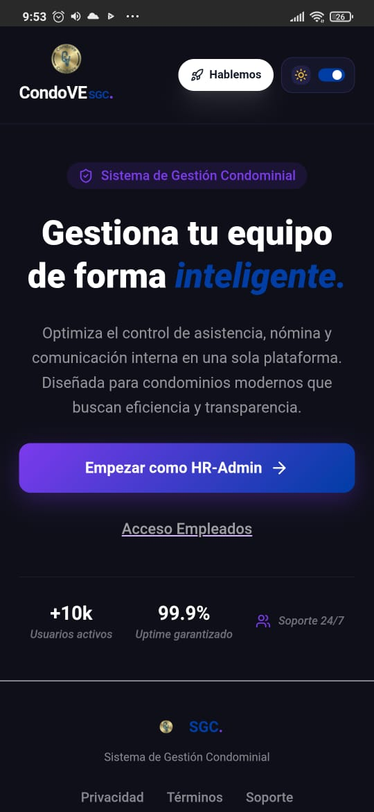
  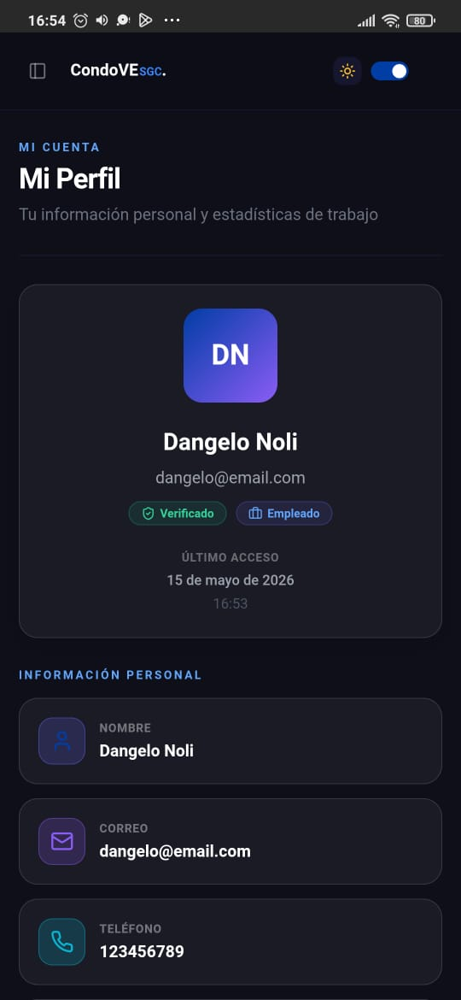
  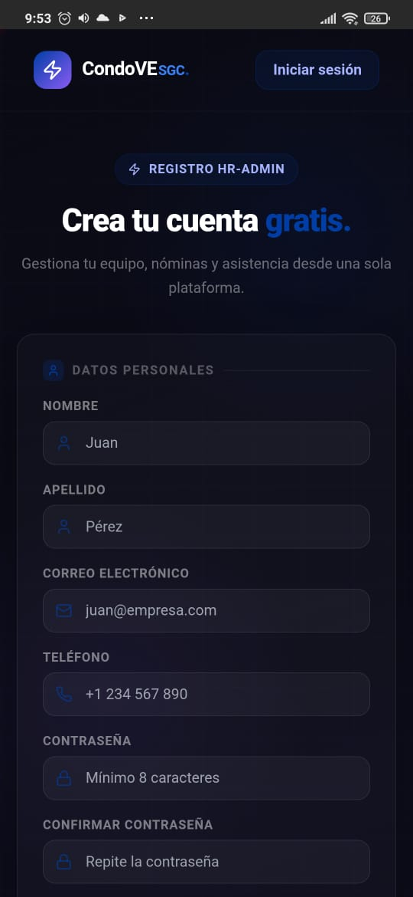
</p>


## 🌟 Key Features

### 1. Role-Based Access Control (RBAC)

* Employee Role: Employees can access personalized dashboards to view their attendance, salaries, notices, and other relevant details.

* HR Role: HR professionals can manage employees, approve leaves, issue notices, and oversee recruitment with advanced controls.

### 2. User Authentication & Authorization

* Secure login system using JWT-based authentication.

* Role-based permissions ensure sensitive data and functionalities are accessed only by authorized users.

### 3. Attendance Management

* Real-time tracking of employee attendance with detailed records.

* Customizable attendance reports for HR and management review.

### 4. Leave Management

* Employees can easily apply for leaves via their dashboard.

* HRs can view, approve, or reject leave requests with appropriate justifications.

### 5. Salary Management

* Employees can access detailed breakdowns of their salaries.

* HRs can manage and generate payroll efficiently.

### 6. Dynamic Notifications System

* Employees receive real-time notifications for company updates, salary releases, and approvals.

* Custom notices can be created and sent by HR.

### 7. Email Transactions

* Automated email system for:

* Password recovery.

* Welcome onboarding emails.

* Notifications for leave and attendance updates.

### 8. Corporate Calendar

* Unified calendar to track company holidays, meetings, and important events.

* Employees and HRs can view and manage the corporate calendar efficiently.

### 9. Employee & Department Management

* HRs can manage departments, add or remove employees, and assign roles dynamically.

* Detailed records of employee profiles and departmental insights.

### 10. Recruitment & Interview Insights

* HRs can track recruitment progress and manage candidate pipelines.

* Insights into interview outcomes and potential hires.

## 💡 Problem Solved

The CondoVe - SGC addresses key challenges faced by small to medium-sized organizations, such as:

* Inefficient Employee Management: By automating attendance, leave, and salary management.

* Communication Gaps: Through dynamic notifications and a centralized corporate calendar.

* Security Concerns: By implementing robust RBAC and secure authentication systems.

* Recruitment Bottlenecks: By providing streamlined tools for HRs to manage recruitment workflows.

## 🔧 Tech Stack

* Frontend: React.js, Redux.js, Tailwind CSS, ShadCN UI Library

* Backend: Node.js, Express.js, RESTful APIs

* Database: MongoDB (NoSQL)

* Authentication: JSON Web Tokens (JWT)

* Version Control: Git, GitHub


#### Clone the repository : 

```

https://github.com/Dangelo-JAN/CondominiosVenezuela.git


## 🚀 Future Enhancements

* Analytics Dashboard: Advanced analytics for HR and management.

* Third-Party Integrations: Integration with tools like Slack and Zoom.


## 🧑‍💻 Authors & Acknowledgments

Dangelo Arrivillaga: Project Lead and Software Engineer


## 📄 License

This project is licensed under the MIT License.

## 📬 Contact

For any questions or support, feel free to reach out:

Email: [Dangelo Arrivillaga GMAIL](dangeloarrivillaga@gmail.com)

LinkedIn: [Dangelo Arrivillaga](https://ve.linkedin.com/in/soluciones-empresariales-dangelo-arrivillaga).

Thank you for visiting the CondoVE project! We hope it provides valuable insights into how technology can simplify employee management.
